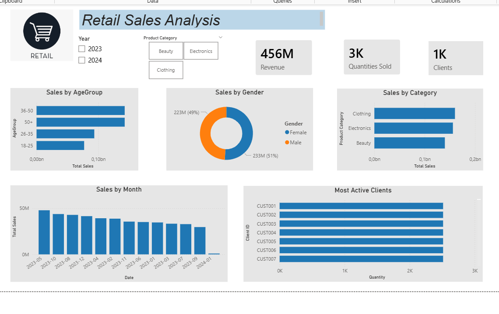

## Retail Sales Analysis 
Project Overview

This project focuses on analyzing retail sales data to understand customer behavior, sales performance, and key business trends. The analysis was performed using Power BI to create an interactive dashboard that supports data-driven decision-making.

## Tools used:
 SQL | POWER BI
 -

